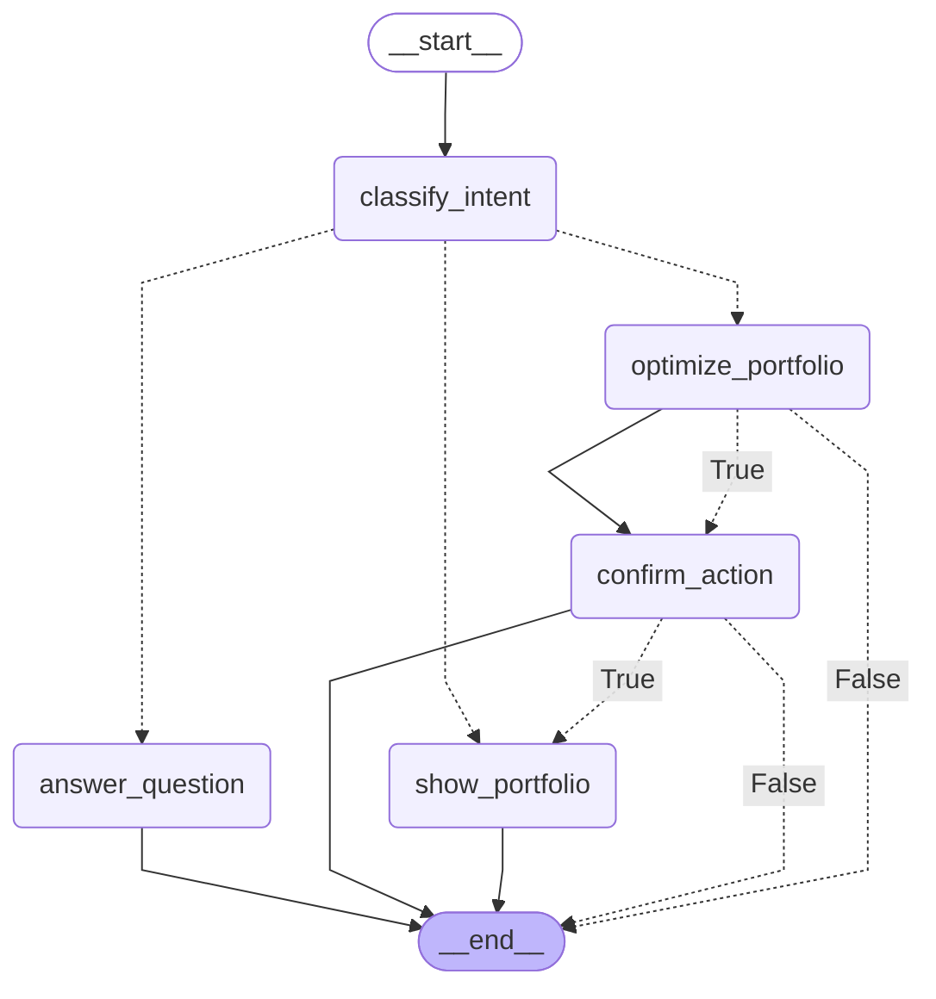

```mermaid
---
config:
  flowchart:
    curve: linear
---
graph TD;
	__start__([<p>__start__</p>]):::first
	classify_intent(classify_intent)
	confirm_action(confirm_action)
	show_portfolio(show_portfolio)
	answer_question(answer_question)
	optimize_portfolio(optimize_portfolio)
	__end__([<p>__end__</p>]):::last
	__start__ --> classify_intent;
	answer_question --> __end__;
	confirm_action --> __end__;
	optimize_portfolio --> confirm_action;
	show_portfolio --> __end__;
	classify_intent -.-> show_portfolio;
	classify_intent -.-> answer_question;
	classify_intent -.-> optimize_portfolio;
	confirm_action -. &nbsp;True&nbsp; .-> show_portfolio;
	confirm_action -. &nbsp;False&nbsp; .-> __end__;
	optimize_portfolio -. &nbsp;True&nbsp; .-> confirm_action;
	optimize_portfolio -. &nbsp;False&nbsp; .-> __end__;
	classDef default fill:#f2f0ff,line-height:1.2
	classDef first fill-opacity:0
	classDef last fill:#bfb6fc

```